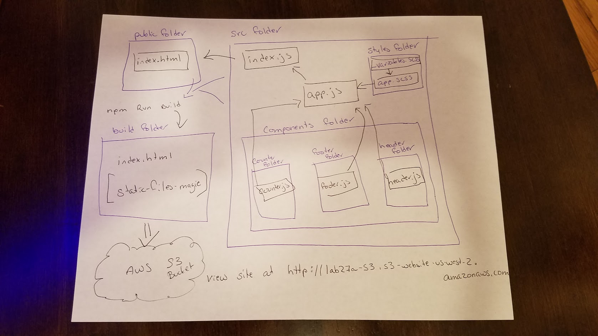

 LAB 27
=================================================

## Lab 27: Testing and Deployment

### Author: Ryan Gallaway

### Links and Resources

* [repo -original](https://github.com/rkgallaway/27-testing-deployment)
* [repo -correctly forked](https://github.com/rkgallaway/27-testing-and-deployment) 
* [travis](https://www.travis-ci.com/rkgallaway/27-testing-and-deployment)
* [latest fork of sandbox](https://codesandbox.io/s/pk48549o2x)
* [aws -S3 deployment](http://lab27a-s3.s3-website-us-west-2.amazonaws.com/)

### Components
#### `counter.js`
#### `header.js`
#### `footer.js`

### Write Tests
* Visit the Sandbox containing the [Lab Starter Code](https://codesandbox.io/s/2471rk2wzr) and FORK it.
* Add some sleek and amazing styling
* Write tests to cover the counter component
  * For Up and Down events
    * Assert state changes properly
    * Assert that state is being transferred to the DOM
    * Assert DOM stability via snapshot testing.
      * i.e. take a snapshot, change the markup/jsx, assert failure.  Put it back to make it all good.

### Deploy the application
* Create a new repository for your application at Github and connect your sandbox to it.
* Clone the repo to your local machine
* Perform an `npm install`
* Perform an `npm run build`
  * You should now have a fully functional static build in the builds folder
* Do a manual deployment of the `build` folder contents to a new Bucket and Cloud at AWS
* Prepare an automated deployment through Cloud Formation
* Make sure that 'aws.yml' and 'build' are in your .gitignore, and then commit your code back to github to auto-deploy

#### Running the app
* `npm start`
* Endpoint: `/foo/bar/`
  * Returns a JSON object with abc in it.
* Endpoint: `/bing/zing/`
  * Returns a JSON object with xyz in it.

#### Tests
* `npm test` to run tests
* Counts up, counts down
* Displays proper polarity
* Snapshot compares / renders correctly 

#### UML Diagram

